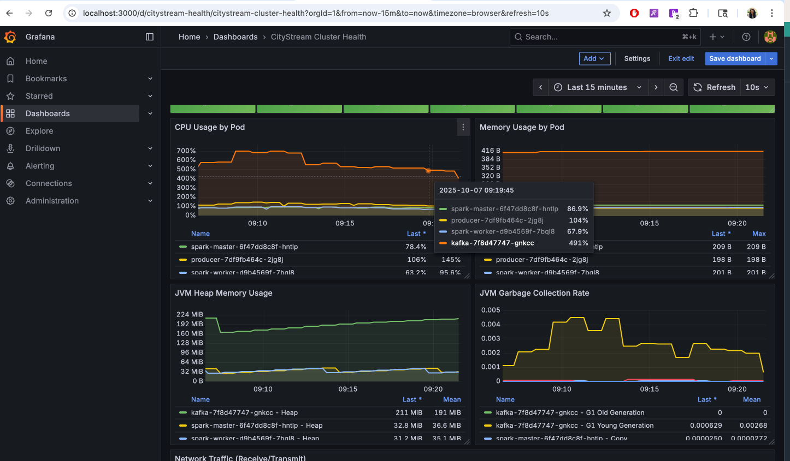
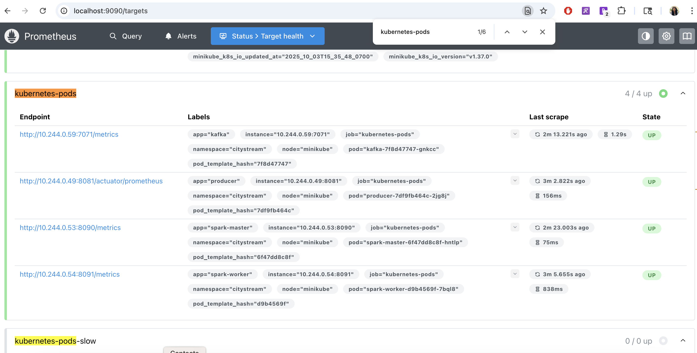
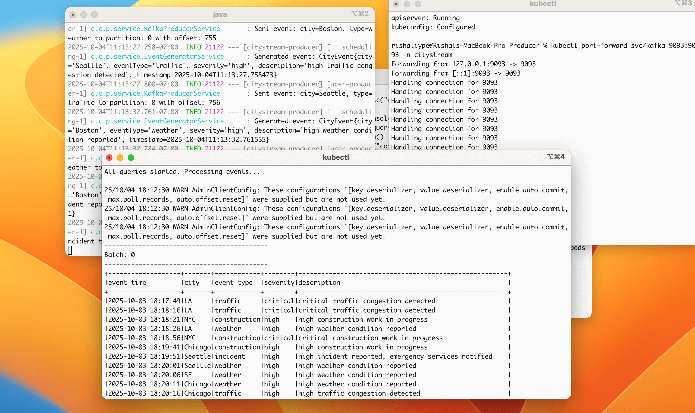

# Kubernetes-Native Streaming Platform with Observability

> **Cloud-native real-time data pipeline** on Kubernetes with Kafka streaming, Spark processing, and built-in monitoring - demonstrating production K8s patterns.

[](https://kubernetes.io/)
[](https://kafka.apache.org/)
[](https://spark.apache.org/)
[](https://openjdk.org/)

[View AWS Version →](https://github.com/rishaliype/Real-Time-Event-Streaming-Pipeline)

---

## What This Demonstrates

**Kubernetes Orchestration:** StatefulSets for Kafka/ZooKeeper, Deployments for Spark cluster, PersistentVolumes for state management

**Microservices Architecture:** Distributed producer, message queue, stream processor, and analytics engine working together

**Production observability** - Prometheus metrics, Grafana dashboards, end-to-end monitoring

---

## System Architecture

```
┌─────────────┐    Metrics     ┌───────────┐
│   Grafana   │◄───────────────┤Prometheus │
│ Dashboards  │                └─────┬─────┘
└─────────────┘                      │ Scrapes every 15s
                                     │
                 ┌───────────────────┴───────────────────┐
                 │      Kubernetes Cluster (Minikube)    │
                 │                                       │
    ┌────────────┼────────────────────────────────────┐  │
    │            │                                    │  │
    │  ┌─────────▼──────┐       ┌─────────────────┐   │  │
    │  │    Producer    │──────▶│     Kafka       │   │  │
    │  │  (Spring Boot) │       │  (StatefulSet)  │   │  │
    │  │  /metrics      │       │  /metrics       │   │  │
    │  └────────────────┘       └────────┬────────┘   │  │
    │                                    │            │  │
    │                                    ▼            │  │
    │                           ┌─────────────────┐   │  │
    │                           │  Spark Cluster  │   │  │
    │                           │  Master+Worker  │   │  │
    │                           │  /metrics       │   │  │
    │                           └────────┬────────┘   │  │
    │                                    │            │  │
    │                                    ▼            │  │
    │                           ┌─────────────────┐   │  │
    │                           │ PersistentVolume│   │  │
    │                           │  (JSON Output)  │   │  │
    │                           └─────────────────┘   │  │
    └────────────────────────────────────────────────┘   │
                                                         │
```

**Data Flow:** Producer generates events → Kafka buffer → Spark processes 5 concurrent queries → Persistent storage + real-time dashboards

---

## Key Features

### Streaming Queries (5 Concurrent)
1. **Windowed Aggregations** - 5-minute tumbling windows with event counts
2. **High-Severity Alerts** - Real-time filtering of critical events
3. **City Summaries** - 1-minute rolling statistics per city
4. **Late-data handling** - 10-minute watermarking
5. **Exactly-once semantics** - Achieved with checkpointing

### Production Observability
- **Prometheus metrics** from all components (Kafka, Spark, Producer)
- **Grafana dashboards** for cluster health and application performance
- **JMX instrumentation** for Java applications
- **Spring Boot Actuator** integration
- **Custom business metrics** (event rates, processing lag)

### Kubernetes Patterns
- **StatefulSets** for Kafka with persistent identity
- **Resource quotas** preventing resource starvation
- **Persistent volumes** for checkpoints and output
- **Service discovery** via ClusterIP services
- **ConfigMaps** for application configuration

---

## Tech Stack

| Component | Technology | Purpose |
|-----------|-----------|---------|
| **Orchestration** | Kubernetes 1.30+ | Container management |
| **Runtime** | Minikube | Local K8s cluster |
| **Stream Processing** | Spark 3.4.1 | Real-time transformations |
| **Message Queue** | Kafka 2.8.1 | Event buffering |
| **Coordination** | ZooKeeper | Kafka cluster management |
| **Application** | Spring Boot 3.3 | Event generation |
| **Monitoring** | Prometheus + Grafana | Metrics collection & visualization |
| **Storage** | Kubernetes PV/PVC | Persistent state management |
| **Build Tool** | Maven 3.8+ | Dependency management |

---

## Quick Start

### Prerequisites
- Minikube (v1.30+)
- kubectl (v1.24+)
- Docker Desktop
- Java 17+, Maven 3.8+
- **Minimum:** 6GB RAM, 3 CPUs for Minikube

### Deploy in 6 Steps

```bash
# 1. Start Kubernetes cluster
minikube start --memory=6144 --cpus=3

# 2. Create namespace
kubectl apply -f k8s/namespace.yaml

# 3. Deploy infrastructure
kubectl apply -f k8s/zookeeper-deploy.yaml
kubectl apply -f k8s/kafka-deploy.yaml
kubectl apply -f k8s/spark-master-deploy.yaml
kubectl apply -f k8s/spark-worker-deploy.yaml
kubectl apply -f k8s/spark-output-pvc.yaml

# 4. Build and deploy producer
cd producer && mvn clean package
kubectl port-forward -n citystream svc/kafka 9093:9093 &
java -jar target/producer-0.0.1-SNAPSHOT.jar

# 5. Deploy Spark consumer
cd ../consumer && mvn clean package
kubectl cp target/consumer-0.0.1-SNAPSHOT.jar \
  citystream/spark-master-<pod-name>:/tmp/consumer.jar

# 6. Start streaming
kubectl exec -it spark-master-<pod-name> -n citystream -- \
  /opt/spark/bin/spark-submit \
  --master spark://spark-master:7077 \
  --deploy-mode client \
  --class com.citystream.consumer.SparkKafkaConsumer \
  /tmp/consumer.jar
```

### Verify Deployment

```bash
# Check all pods are running
kubectl get pods -n citystream

# View producer metrics
curl http://localhost:8081/metrics/producer

# View Spark UI
minikube service spark-master-ui -n citystream

# Check stored data
kubectl exec -it spark-master-<pod> -n citystream -- \
  ls -la /opt/spark-output/windowed-aggregations/

# Access Grafana dashboards (after monitoring setup)
kubectl port-forward -n monitoring svc/grafana 3000:80
# Visit: http://localhost:3000 (admin/admin)
```

---

## Data Pipeline

### Event Schema
```json
{
  "city": "NYC",
  "event_type": "traffic|weather|incident|construction",
  "severity": "low|medium|high|critical",
  "description": "Event description",
  "timestamp": "2025-10-13T11:30:00Z"
}
```

### Aggregation Output
```json
{
  "window_start": "2025-10-13T11:30:00",
  "window_end": "2025-10-13T11:35:00",
  "city": "NYC",
  "event_type": "traffic",
  "event_count": 15,
  "severities": ["high", "medium", "low"]
}
```
## Monitoring Setup

This project includes **production-grade observability** with Prometheus and Grafana.

## Quick Setup

### 1. Install Monitoring Stack

```bash
# Add Helm repository
helm repo add prometheus-community https://prometheus-community.github.io/helm-charts
helm repo update

# Install Prometheus + Grafana together
helm install prometheus prometheus-community/kube-prometheus-stack \
  --namespace monitoring \
  --create-namespace \
  --set prometheus.prometheusSpec.serviceMonitorSelectorNilUsesHelmValues=false

# Verify installation
kubectl get pods -n monitoring
```
### 2. Configure Metrics Exporters

All application pods already have metrics endpoints configured via:
- **Producer:** Spring Boot Actuator + Micrometer
- **Kafka:** JMX Exporter (custom Docker image)
- **Spark:** JMX Exporter (custom Docker image)

Pod annotations tell Prometheus where to scrape:
```yaml
annotations:
  prometheus.io/scrape: "true"
  prometheus.io/port: "8081"
  prometheus.io/path: "/actuator/prometheus"
```

### 3. Access Dashboards

```bash
# Grafana (default: admin/prom-operator)
kubectl port-forward -n monitoring svc/prometheus-grafana 3000:80
# Visit: http://localhost:3000

# Prometheus UI
kubectl port-forward -n monitoring svc/prometheus-kube-prometheus-prometheus 9090:9090
# Visit: http://localhost:9090
```

### 4. Verify Metrics Collection

In Prometheus UI:
1. Go to **Status → Targets**
2. Verify all `citystream` pods are **UP**
3. Test query: `up{namespace="citystream"}`

## Grafana Dashboard Setup

### Import Pre-Built Dashboard

1. **Download** the dashboard JSON from `docs/grafana-dashboard.json`
2. In Grafana: **Dashboards → Import**
3. Upload JSON file
4. Select **Prometheus** data source
5. Click **Import**

### Build Custom Dashboard

Create a new dashboard with these panels:

#### Panel 1: Cluster Health (Stat)
```promql
up{namespace="citystream"}
```
- **Visualization:** Stat
- **Thresholds:** Red if < 1
- **Repeat:** By `app` label

#### Panel 2: Event Production Rate (Graph)
```promql
rate(spring_kafka_template_seconds_count{namespace="citystream"}[5m])
```
- **Visualization:** Time series
- **Y-axis:** messages/sec
- **Legend:** Producer Event Rate

#### Panel 3: Memory Usage by Component (Graph)
```promql
jvm_memory_bytes_used{namespace="citystream", area="heap"} / 1024 / 1024
```
- **Visualization:** Time series
- **Y-axis:** MiB
- **Legend:** `{{pod}}`

#### Panel 4: Kafka Send Latency (Graph)
```promql
rate(spring_kafka_template_seconds_sum{namespace="citystream"}[5m]) 
/ 
rate(spring_kafka_template_seconds_count{namespace="citystream"}[5m]) 
* 1000
```
- **Visualization:** Time series
- **Y-axis:** milliseconds
- **Threshold:** Warn if > 100ms

#### Panel 5: JVM Garbage Collection (Graph)
```promql
rate(jvm_gc_collection_seconds_sum{namespace="citystream"}[5m])
```
- **Visualization:** Time series
- **Y-axis:** seconds/second
- **Legend:** `{{pod}} - {{gc}}`

### What's Monitored

**Infrastructure Metrics:**
- Pod health, CPU, memory usage
- Kafka broker metrics, partition lag
- Spark executor stats, batch processing times

**Application Metrics:**
- Event production rate (messages/sec)
- Kafka send latency (p50, p95, p99)
- Processing lag (event time vs processing time)
- Invalid message tracking

### Sample Dashboard

The Grafana dashboard shows:
- **Cluster Health** - All pods up/down status
- **Resource Usage** - CPU, memory, JVM heap across services
- **Throughput** - Events per second, successful vs failed
- **Latency** - End-to-end processing time
- **Business Metrics** - Events by city, severity distribution

---

## Screenshots & Monitoring in Action

### Grafana Dashboard - Cluster Health Overview

*Real-time cluster monitoring showing all pods in healthy status with comprehensive metrics including CPU usage, memory consumption, JVM heap utilization, and garbage collection activity across Producer, Kafka, and Spark components.*

### Prometheus Targets Health Status

*Verification that all application pods are successfully registered and actively scraped by Prometheus, showing Kafka, Producer, and Spark Master/Worker endpoints all in UP state with their respective metrics endpoints.*

### Producer Event Generation

*Spring Boot producer in action, generating real-time city events with diverse event types (traffic, weather, incident, construction) and severity levels, successfully sending to Kafka with latency tracking (9ms-25ms range).*

### Windowed Aggregations Output

*Spark Structured Streaming processing results displaying 5-minute windowed aggregations with event counts, city information, event types, and severity distributions organized by time windows.*

### City Summary Analytics

*Post-processing batch analytics showing events grouped by city and event type, demonstrating the ability to run complex queries on the streamed data for business intelligence and operational insights.*

### Kubernetes Deployment Verification

*Confirmation that all Kubernetes pods (Kafka, Spark Master/Worker, ZooKeeper) are running and stable with correct restart counts and uptime, verifying successful deployment and cluster health.*

---

## Production Patterns Implemented

### Stateful Services on K8s
- **Challenge:** Kafka needs persistent identity and storage across restarts
- **Solution:** PersistentVolumeClaim with stable pod identity via StatefulSet pattern
- **Learning:** Stateful services require careful volume management

### Resource Management
- **Challenge:** Spark jobs consuming too much memory causing OOM kills
- **Solution:** Explicit resource requests/limits on all pods
- **Result:** Stable cluster with predictable resource usage

### Network Communication
- **Challenge:** Producer outside K8s couldn't reach Kafka
- **Solution:** Port-forwarding for external access, ClusterIP for internal
- **Learning:** K8s networking requires explicit configuration for external access

### Fault Tolerance
- **Challenge:** Pod crashes losing processing state
- **Solution:** Spark checkpointing to persistent volume
- **Result:** Resumable processing after failures

---

## Skills Demonstrated

**Kubernetes Administration** - Deployments, Services, PVCs, Namespaces  
**Distributed Stream Processing** - Spark Structured Streaming with multiple outputs  
**Message Queue Architecture** - Kafka with ZooKeeper coordination  
**Container Orchestration** - Multi-pod application with interdependencies  
**Persistent State Management** - Volumes for checkpoints and output  
**Observability** - Built-in metrics, logging, and monitoring  
**Fault Tolerance** - Checkpointing, restarts, recovery mechanisms  
**Resource Optimization** - CPU/memory tuning for stable operation

---

## Batch Analytics

Run post-processing analysis on streaming output:

```bash
kubectl exec -it spark-master-<pod> -n citystream -- \
  /opt/spark/bin/spark-submit \
  --master 'local[*]' \
  --class com.citystream.consumer.DataAnalyzer \
  /tmp/analyzer.jar \
  /opt/spark-output
```

**Queries:**
- Events by city and severity
- Top cities with critical events  
- Hourly traffic patterns
- Processing lag statistics
- Time window analysis

---

## Related Projects

- **[Real-Time Event Streaming Pipeline](https://github.com/rishaliype/Real-Time-Event-Streaming-Pipeline)** - AWS deployment with DynamoDB and EC2

---

###  Project Context

Built to demonstrate production-ready Kubernetes patterns. Showcases distributed systems expertise, cloud-native architecture, and real-time data processing.
---

**Built with:** Kubernetes • Apache Kafka • Apache Spark • Spring Boot • Docker • Java 17
